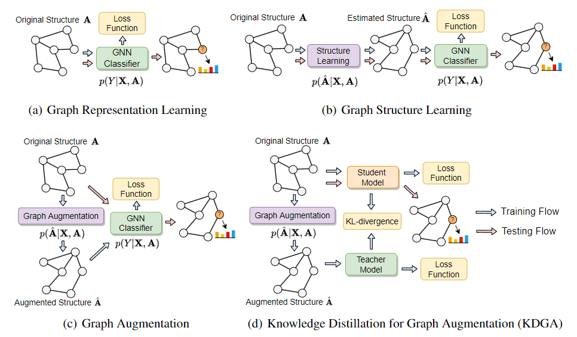

# Knowledge Distillation for Graph Augmentation (KDGA)

This is a PyTorch implementation of the Knowledge Distillation Improves Graph Augmentation (KDGA), and the code includes the following modules:

* Dataset Loader (Cora, Citeseer, Texas, Cornell, Wisconsin, Actor, Chameleon, and Squirrel)

* GCN Classifier for implementing $p(Y|A,X)$, and Graph Augmentation Module for implementing $p(\widehat{A}|A,X)$

* Training paradigm for pre-training and fine-tuning on eight real-world datasets

* Visualization and evaluation metrics 

  

## Introduction

Graph (structure) augmentation aims to perturb the graph structure through heuristic or probabilistic rules, enabling the nodes to capture richer contextual information and thus improving generalization performance. While there have been a few graph structure augmentation methods proposed recently, none of them are aware of a potential \textit{negative augmentation} problem, which may be caused by overly severe distribution shifts between the original and augmented graphs. In this paper, we take an important graph property, namely graph homophily, to analyze the distribution shifts between the two graphs and thus measure the severity of an augmentation algorithm suffering from negative augmentation. To tackle this problem, we propose a novel Knowledge Distillation for Graph Augmentation (KDGA) framework, which helps to reduce the potential negative effects of distribution shifts, i.e., negative augmentation problem. Specifically, KDGA extracts the knowledge of any GNN teacher model trained on the augmented graphs and injects it into a partially parameter-shared student model that is tested on the original graph. As a simple but efficient framework, KDGA is applicable to a variety of existing graph augmentation methods and can significantly improve the performance of various GNN architectures. For three popular graph augmentation methods, the experimental results show that the learned student models outperform their vanilla implementations by an average accuracy of 4.6% (GAUG), 4.2% (MH-Aug), and 4.6% (GraphAug) on eight graph datasets.


<p align="center">
  
</p>


## Dependenciesc

* numpy==1.19.2
* scipy==1.3.1
* torch==1.6.0
* pyro==1.3.0


## Overview

* main.py  
  * pretrain_Augmentor() -- Pretrain Graph Augmentation Module - GraphAug
  * pretrain_Classifier() -- Pretrain GNN Classifier
  * main() -- Train the model for node classification task on eight real-world datasets
* model.py  
  
  * GCNLayer() -- GCN Layer
  * GCN_Classifier() -- GCN Classifier for implementing the function $p(Y|A,X)$
  * Augmentor() -- Graph Augmentation Module - GraphAug for implementing the function $p(\widehat{A}|A,X)$
  * com_distillation_loss() -- Calculate the KL-divergence Loss for knowledge distillation
* dataset.py  

  * load_data() -- Load Cora, Citeseer, Texas, Cornell, Wisconsin, Actor, Chameleon, and Squirrel datasets
* utils.py  
  * evaluation() -- Calculate classification accuracy


## Running the code

1. Install the required dependency packages

3. To get the results on a specific *dataset*, please run with proper hyperparameters:

  ```
python main.py --dataset data_name --loss_mode mode
  ```

where the *data_name* is one of the eight datasets (Cora, Citeseer, Texas, Cornell, Wisconsin, Actor, Chameleon, and Squirrel), and *loss_mode* denotes different experimental settings (-1: default optimal hyperparameters obtained by NNI; 0: w/ parameter-shared DKGA; 1: w/ parameter-independent DKGA; 2: vanilla GraphAug; 3: vanilla GCN). Use the default optimal hyperparameters on the *Citeseer* dataset as an example: 

```
python main.py --dataset citeseer --loss_mode -1
```


## Citation

If you find this project useful for your research, please use the following BibTeX entry.

```
@article{wu2022knowledge,
  title={Knowledge Distillation Improves Graph Structure Augmentation for Graph Neural Networks},
  author={Wu, Lirong and Lin, Haitao and Huang, Yufei and  and Li, Stan Z.},
  journal={Advances in Neural Information Processing Systems},
  year={2022}
}
```